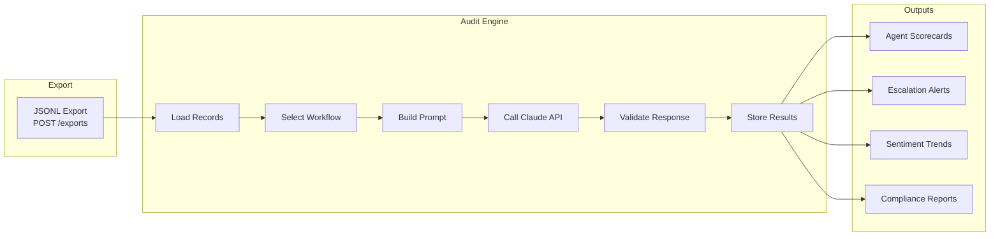

# Claude Auditing Workflows — Enterprise QA Pipeline

## Overview

This document defines the complete Claude-powered auditing system for Rinkel call quality assurance. Each workflow takes JSONL export records as input and produces structured JSON audit results.

> [!IMPORTANT]
> **Grounding Rule**: Every Claude prompt in this system must include the full call transcript inline. Claude must never be asked to "recall" or "look up" data — all evidence must be present in the prompt.

---

## 1. Example JSONL Records

### Record A — Standard Inbound (Dutch, resolved)

```json
{
  "call_id": "c8f1a2b3-4d5e-6f7a-8b9c-0d1e2f3a4b5c",
  "external_call_id": "RINKEL-2026-045872",
  "agent": {
    "agent_id": "a1b2c3d4-5e6f-7a8b-9c0d-1e2f3a4b5c6d",
    "external_agent_id": "agent-jan-devries",
    "display_name": "Jan de Vries",
    "email": "jan@company.nl"
  },
  "direction": "inbound",
  "source": "rinkel",
  "caller_number": "+31612345678",
  "caller_name": "Pieter Bakker",
  "callee_number": "+31201234567",
  "callee_name": "",
  "started_at": "2026-05-28T09:15:00Z",
  "ended_at": "2026-05-28T09:18:24Z",
  "duration_seconds": 204,
  "status": "transcribed",
  "recording_url": "https://cdn.rinkel.com/recordings/045872.wav",
  "audio_drive_url": "https://drive.google.com/file/d/1AbCdEf/view",
  "transcript": {
    "transcript_id": "t1a2b3c4-5d6e-7f8a-9b0c-1d2e3f4a5b6c",
    "content": "Goedemorgen, u spreekt met Jan de Vries, klantenservice. Waarmee kan ik u helpen? Ja, goedemorgen, met Pieter Bakker. Ik heb een vraag over mijn factuur van april. Ik zie een bedrag van 47 euro en 50 cent en dat komt niet overeen met wat ik verwacht had. Ik begrijp het, meneer Bakker. Laat me even uw account erbij pakken. Kunt u mij uw klantnummer geven? Ja, dat is KL-4589. Dank u wel. Ik zie uw account hier. Het bedrag van 47,50 is correct. U had in april een extra belminuut-pakket geactiveerd. Wilt u dat ik uitleg hoe dat is opgebouwd? Ja, graag. Oké, uw basispakket is 29,95. Daarbovenop heeft u op 3 april het uitbreidingspakket van 17,55 geactiveerd. Samen is dat 47,50. Ah, nu begrijp ik het. Ik was vergeten dat ik dat had gedaan. Dank u voor de uitleg. Graag gedaan, meneer Bakker. Kan ik u nog ergens anders mee helpen? Nee, dat was het. Bedankt en prettige dag. Insgelyks, een fijne dag!",
    "language": "nl",
    "confidence_score": 0.94,
    "model_name": "whisper-1",
    "duration_seconds": 204.0,
    "segments": [
      {"id": 0, "start": 0.0, "end": 4.2, "text": "Goedemorgen, u spreekt met Jan de Vries, klantenservice."},
      {"id": 1, "start": 4.2, "end": 6.8, "text": "Waarmee kan ik u helpen?"},
      {"id": 2, "start": 7.1, "end": 9.5, "text": "Ja, goedemorgen, met Pieter Bakker."},
      {"id": 3, "start": 9.5, "end": 16.0, "text": "Ik heb een vraag over mijn factuur van april."},
      {"id": 4, "start": 16.0, "end": 22.5, "text": "Ik zie een bedrag van 47 euro en 50 cent en dat komt niet overeen met wat ik verwacht had."},
      {"id": 5, "start": 23.0, "end": 27.5, "text": "Ik begrijp het, meneer Bakker. Laat me even uw account erbij pakken."},
      {"id": 6, "start": 27.5, "end": 31.0, "text": "Kunt u mij uw klantnummer geven?"},
      {"id": 7, "start": 31.5, "end": 34.0, "text": "Ja, dat is KL-4589."},
      {"id": 8, "start": 34.5, "end": 39.0, "text": "Dank u wel. Ik zie uw account hier."},
      {"id": 9, "start": 39.0, "end": 46.0, "text": "Het bedrag van 47,50 is correct. U had in april een extra belminuut-pakket geactiveerd."},
      {"id": 10, "start": 46.0, "end": 50.0, "text": "Wilt u dat ik uitleg hoe dat is opgebouwd?"},
      {"id": 11, "start": 50.5, "end": 52.0, "text": "Ja, graag."},
      {"id": 12, "start": 52.5, "end": 62.0, "text": "Oké, uw basispakket is 29,95. Daarbovenop heeft u op 3 april het uitbreidingspakket van 17,55 geactiveerd. Samen is dat 47,50."},
      {"id": 13, "start": 62.5, "end": 69.0, "text": "Ah, nu begrijp ik het. Ik was vergeten dat ik dat had gedaan. Dank u voor de uitleg."},
      {"id": 14, "start": 69.5, "end": 74.0, "text": "Graag gedaan, meneer Bakker. Kan ik u nog ergens anders mee helpen?"},
      {"id": 15, "start": 74.5, "end": 78.0, "text": "Nee, dat was het. Bedankt en prettige dag."},
      {"id": 16, "start": 78.5, "end": 81.0, "text": "Insgelyks, een fijne dag!"}
    ]
  },
  "exported_at": "2026-05-30T08:00:00Z",
  "export_version": "1.0"
}
```

### Record B — Escalation (angry customer, unresolved)

```json
{
  "call_id": "d9e2f3a4-5b6c-7d8e-9f0a-1b2c3d4e5f6a",
  "external_call_id": "RINKEL-2026-045901",
  "agent": {
    "agent_id": "b2c3d4e5-6f7a-8b9c-0d1e-2f3a4b5c6d7e",
    "external_agent_id": "agent-sophie-vandijk",
    "display_name": "Sophie van Dijk",
    "email": "sophie@company.nl"
  },
  "direction": "inbound",
  "source": "rinkel",
  "caller_number": "+31698765432",
  "caller_name": "Maria Jansen",
  "callee_number": "+31201234567",
  "started_at": "2026-05-28T14:32:00Z",
  "ended_at": "2026-05-28T14:39:15Z",
  "duration_seconds": 435,
  "status": "transcribed",
  "transcript": {
    "transcript_id": "u2v3w4x5-6y7z-8a9b-0c1d-2e3f4a5b6c7d",
    "content": "Klantenservice, u spreekt met Sophie. Ja, ik bel al voor de derde keer deze week! Ik heb al twee keer gebeld over mijn internet dat niet werkt en er is nog steeds niets opgelost! Ik begrijp dat dit heel vervelend voor u is, mevrouw. Kunt u mij uw klantnummer geven zodat ik kan kijken wat er tot nu toe is gedaan? KL-8832. Maar ik wil nu echt dat dit opgelost wordt, want ik werk vanuit huis en ik kan zo niet werken! Ik zie het hier, mevrouw Jansen. Er is op maandag een storing gemeld en op dinsdag heeft een collega een reset op afstand gedaan. Ja, en dat heeft niet geholpen! Het internet valt nog steeds elke paar uur uit. Ik begrijp het. Ik ga nu een monteur voor u inplannen. Dat is de snelste manier om dit structureel op te lossen. Wanneer is dat dan? Want ik heb al drie dagen gewacht. De eerste beschikbare plek is aanstaande vrijdag tussen 9 en 12. Vrijdag?! Dat is nog twee dagen! Ik heb dit internet nodig voor mijn werk! Kan er niet iemand eerder komen? Ik begrijp dat dit urgent is. Helaas is vrijdag de eerste beschikbare plek. Ik kan u wel op de wachtlijst zetten voor een eerder moment als er een annulering is. Dit is echt onacceptabel. Ik wil een klacht indienen en ik wil een manager spreken. Ik begrijp uw frustratie volledig, mevrouw Jansen. Ik zal een klacht voor u registreren en ik zal aan mijn teamleider vragen om u vandaag nog terug te bellen. Kan ik uw telefoonnummer bevestigen? Ja, 06-98765432. En ik wil ook compensatie voor de dagen dat het niet werkte. Ik noteer uw verzoek om compensatie. Mijn teamleider zal dit met u bespreken wanneer hij u terugbelt. Is er nog iets anders? Nee, maar ik verwacht wel vandaag nog een telefoontje. Anders bel ik morgen weer. Dat begrijp ik. Ik zorg ervoor dat de terugbelnotitie als urgent wordt gemarkeerd. Fijne dag verder, mevrouw Jansen.",
    "language": "nl",
    "confidence_score": 0.91,
    "model_name": "whisper-1",
    "duration_seconds": 435.0,
    "segments": [
      {"id": 0, "start": 0.0, "end": 3.0, "text": "Klantenservice, u spreekt met Sophie."},
      {"id": 1, "start": 3.5, "end": 12.0, "text": "Ja, ik bel al voor de derde keer deze week! Ik heb al twee keer gebeld over mijn internet dat niet werkt en er is nog steeds niets opgelost!"},
      {"id": 2, "start": 12.5, "end": 19.0, "text": "Ik begrijp dat dit heel vervelend voor u is, mevrouw. Kunt u mij uw klantnummer geven zodat ik kan kijken wat er tot nu toe is gedaan?"},
      {"id": 3, "start": 19.5, "end": 26.0, "text": "KL-8832. Maar ik wil nu echt dat dit opgelost wordt, want ik werk vanuit huis en ik kan zo niet werken!"}
    ]
  },
  "exported_at": "2026-05-30T08:00:00Z",
  "export_version": "1.0"
}
```

### Record C — Short Outbound (follow-up)

```json
{
  "call_id": "e0f1a2b3-4c5d-6e7f-8a9b-0c1d2e3f4a5b",
  "external_call_id": "RINKEL-2026-045955",
  "agent": {
    "agent_id": "a1b2c3d4-5e6f-7a8b-9c0d-1e2f3a4b5c6d",
    "external_agent_id": "agent-jan-devries",
    "display_name": "Jan de Vries",
    "email": "jan@company.nl"
  },
  "direction": "outbound",
  "source": "rinkel",
  "caller_number": "+31201234567",
  "callee_number": "+31687654321",
  "callee_name": "Hans de Boer",
  "started_at": "2026-05-28T16:45:00Z",
  "ended_at": "2026-05-28T16:47:30Z",
  "duration_seconds": 150,
  "status": "transcribed",
  "transcript": {
    "transcript_id": "v3w4x5y6-7z8a-9b0c-1d2e-3f4a5b6c7d8e",
    "content": "Goedemiddag, u spreekt met Jan de Vries van de klantenservice. Kan ik meneer De Boer spreken? Ja, daar spreekt u mee. Goedemiddag, meneer De Boer. Ik bel u even naar aanleiding van uw klacht van gisteren over de facturering. Wij hebben het uitgezocht en u heeft gelijk, er is een fout gemaakt bij het opmaken van de factuur. Wij zullen het verschil van 15 euro crediteren op uw volgende factuur. Ah, fijn dat het zo snel is opgelost. Dank u wel voor het terugbellen. Graag gedaan. Mijn excuses voor het ongemak. Heeft u nog andere vragen? Nee hoor, het is goed zo. Prettige dag nog. U ook, meneer De Boer. Tot ziens.",
    "language": "nl",
    "confidence_score": 0.96,
    "model_name": "whisper-1",
    "duration_seconds": 150.0,
    "segments": []
  },
  "exported_at": "2026-05-30T08:00:00Z",
  "export_version": "1.0"
}
```

---

## 2. Claude Prompt Templates

### 2.1 System Prompt (shared across all workflows)

```
You are a senior call quality auditor for a Dutch telecommunications company. You audit customer service calls based on transcripts.

RULES:
1. Base ALL analysis on the transcript text provided. Never infer information not present.
2. If the transcript is unclear or incomplete, explicitly say "INSUFFICIENT DATA" for that field.
3. Respond ONLY with the requested JSON structure. No preamble, no commentary.
4. Quote exact phrases from the transcript as evidence for every finding.
5. All scores use a 1-5 scale unless otherwise specified.
6. The transcript language is Dutch. Provide your analysis in English.
7. If confidence_score < 0.80, flag the transcript as LOW_QUALITY and reduce certainty of findings.
8. Never fabricate quotes. If you cannot find evidence, leave the evidence field as null.
```

> [!CAUTION]
> **Hallucination Prevention**: The system prompt explicitly demands verbatim quotes, prohibits fabrication, and requires "INSUFFICIENT DATA" for missing information. Every prompt below reinforces these constraints.

---

### 2.2 Comprehensive Call Audit

**Purpose**: Full QA scorecard for every call.

```
<system>
{SYSTEM_PROMPT}
</system>

<call_record>
Call ID: {call_id}
External ID: {external_call_id}
Agent: {agent.display_name}
Direction: {direction}
Duration: {duration_seconds} seconds
Date: {started_at}
Transcript Confidence: {transcript.confidence_score}

TRANSCRIPT:
{transcript.content}
</call_record>

Audit this call against the following criteria and return a JSON object:

{
  "call_id": "<call_id>",
  "agent": "<agent name>",
  "audit_date": "<ISO timestamp>",

  "greeting": {
    "score": <1-5>,
    "company_identified": <true|false>,
    "agent_identified": <true|false>,
    "evidence": "<exact quote>"
  },

  "problem_identification": {
    "score": <1-5>,
    "issue_understood": <true|false>,
    "clarifying_questions_asked": <true|false>,
    "customer_acknowledged": <true|false>,
    "evidence": "<exact quote>"
  },

  "resolution": {
    "score": <1-5>,
    "resolved": <true|false>,
    "resolution_type": "<resolved|escalated|deferred|unresolved>",
    "next_steps_communicated": <true|false>,
    "evidence": "<exact quote>"
  },

  "professionalism": {
    "score": <1-5>,
    "polite_language": <true|false>,
    "empathy_shown": <true|false>,
    "customer_addressed_by_name": <true|false>,
    "evidence": "<exact quote>"
  },

  "closing": {
    "score": <1-5>,
    "additional_help_offered": <true|false>,
    "farewell_appropriate": <true|false>,
    "evidence": "<exact quote>"
  },

  "overall_score": <1-5 average>,
  "flags": ["<list of any concerns>"],
  "summary": "<2-3 sentence summary>",
  "transcript_quality": "<HIGH|MEDIUM|LOW based on confidence_score>"
}
```

**Expected Response for Record A:**

```json
{
  "call_id": "c8f1a2b3-4d5e-6f7a-8b9c-0d1e2f3a4b5c",
  "agent": "Jan de Vries",
  "audit_date": "2026-05-30T08:16:00Z",

  "greeting": {
    "score": 5,
    "company_identified": true,
    "agent_identified": true,
    "evidence": "Goedemorgen, u spreekt met Jan de Vries, klantenservice."
  },

  "problem_identification": {
    "score": 5,
    "issue_understood": true,
    "clarifying_questions_asked": true,
    "customer_acknowledged": true,
    "evidence": "Ik begrijp het, meneer Bakker. Laat me even uw account erbij pakken. Kunt u mij uw klantnummer geven?"
  },

  "resolution": {
    "score": 5,
    "resolved": true,
    "resolution_type": "resolved",
    "next_steps_communicated": true,
    "evidence": "Uw basispakket is 29,95. Daarbovenop heeft u op 3 april het uitbreidingspakket van 17,55 geactiveerd. Samen is dat 47,50."
  },

  "professionalism": {
    "score": 5,
    "polite_language": true,
    "empathy_shown": true,
    "customer_addressed_by_name": true,
    "evidence": "Graag gedaan, meneer Bakker."
  },

  "closing": {
    "score": 5,
    "additional_help_offered": true,
    "farewell_appropriate": true,
    "evidence": "Kan ik u nog ergens anders mee helpen? ... Insgelyks, een fijne dag!"
  },

  "overall_score": 5.0,
  "flags": [],
  "summary": "Excellent call handling. Agent identified himself and the company, quickly understood the billing question, provided a clear and accurate explanation of the charges, and closed the call professionally. Customer left satisfied.",
  "transcript_quality": "HIGH"
}
```

---

### 2.3 Escalation Detection

**Purpose**: Flag calls requiring supervisor attention.

```
<system>
{SYSTEM_PROMPT}
</system>

<call_record>
Call ID: {call_id}
Agent: {agent.display_name}
Duration: {duration_seconds} seconds
Direction: {direction}

TRANSCRIPT:
{transcript.content}
</call_record>

Analyze this call for escalation signals and return:

{
  "call_id": "<call_id>",
  "escalation_detected": <true|false>,
  "severity": "<none|low|medium|high|critical>",

  "signals": [
    {
      "type": "<complaint|anger|threat|repeat_contact|manager_request|legal_mention|churn_risk|regulatory>",
      "confidence": <0.0-1.0>,
      "evidence": "<exact quote from transcript>",
      "timestamp_range": "<start_seconds - end_seconds if available>"
    }
  ],

  "repeat_contact_indicators": {
    "detected": <true|false>,
    "evidence": "<exact quote mentioning previous contact>"
  },

  "manager_request": {
    "requested": <true|false>,
    "evidence": "<exact quote>"
  },

  "compensation_request": {
    "requested": <true|false>,
    "type": "<refund|credit|discount|service|other|null>",
    "evidence": "<exact quote>"
  },

  "recommended_action": "<brief recommendation>",
  "priority": "<P1|P2|P3|P4>"
}
```

---

### 2.4 Customer Sentiment Analysis

**Purpose**: Track customer satisfaction through the call.

```
<system>
{SYSTEM_PROMPT}
</system>

<call_record>
Call ID: {call_id}
Agent: {agent.display_name}

TRANSCRIPT:
{transcript.content}

SEGMENTS (for temporal analysis):
{transcript.segments as JSON}
</call_record>

Analyze customer sentiment throughout this call:

{
  "call_id": "<call_id>",

  "overall_sentiment": {
    "label": "<very_negative|negative|neutral|positive|very_positive>",
    "score": <-1.0 to 1.0>,
    "confidence": <0.0-1.0>
  },

  "sentiment_trajectory": {
    "start": "<sentiment at call opening>",
    "middle": "<sentiment during main interaction>",
    "end": "<sentiment at call closing>",
    "trend": "<improving|stable|declining>"
  },

  "emotional_moments": [
    {
      "timestamp_seconds": <approximate>,
      "emotion": "<frustration|anger|relief|gratitude|confusion|satisfaction>",
      "intensity": "<mild|moderate|strong>",
      "evidence": "<exact quote>"
    }
  ],

  "customer_satisfaction_prediction": {
    "likely_csat": <1-5>,
    "reasoning": "<brief explanation based on evidence>"
  },

  "agent_emotional_impact": {
    "de_escalation_effective": <true|false|null>,
    "empathy_moments": ["<exact quotes showing empathy>"],
    "missed_opportunities": ["<moments where empathy could have helped>"]
  }
}
```

---

### 2.5 Compliance & Protocol Audit

**Purpose**: Verify adherence to company policies.

```
<system>
{SYSTEM_PROMPT}

PROTOCOL CHECKLIST:
1. Agent must identify themselves and the company name
2. Agent must verify customer identity (name + account number)
3. Agent must not disclose other customers' information
4. Agent must not make unauthorized promises (discounts > 15%, contract changes)
5. Agent must offer further assistance before closing
6. Agent must document follow-up actions (visible in transcript as verbal confirmation)
7. Privacy-sensitive data (BSN, creditcard, passwords) must not be read back fully
</system>

<call_record>
Call ID: {call_id}
Agent: {agent.display_name}

TRANSCRIPT:
{transcript.content}
</call_record>

Audit compliance against the protocol checklist:

{
  "call_id": "<call_id>",

  "compliance_checks": [
    {
      "rule": "agent_identification",
      "status": "<pass|fail|partial|not_applicable>",
      "evidence": "<exact quote or null>"
    },
    {
      "rule": "customer_verification",
      "status": "<pass|fail|partial|not_applicable>",
      "evidence": "<exact quote or null>"
    },
    {
      "rule": "no_data_leakage",
      "status": "<pass|fail|partial|not_applicable>",
      "evidence": "<exact quote of violation, or null>"
    },
    {
      "rule": "authorized_promises_only",
      "status": "<pass|fail|partial|not_applicable>",
      "evidence": "<exact quote or null>"
    },
    {
      "rule": "offered_further_assistance",
      "status": "<pass|fail|partial|not_applicable>",
      "evidence": "<exact quote or null>"
    },
    {
      "rule": "documented_follow_up",
      "status": "<pass|fail|partial|not_applicable>",
      "evidence": "<exact quote or null>"
    },
    {
      "rule": "privacy_data_handling",
      "status": "<pass|fail|partial|not_applicable>",
      "evidence": "<exact quote of violation, or null>"
    }
  ],

  "compliance_score": "<0-100 percentage>",
  "violations": ["<list of rule names that failed>"],
  "risk_level": "<none|low|medium|high|critical>"
}
```

---

### 2.6 Batch Agent Scoring

**Purpose**: Score multiple calls per agent for performance review.

```
<system>
{SYSTEM_PROMPT}

You are analyzing a BATCH of calls for a single agent. Provide per-call scores AND an aggregate assessment.
</system>

<agent>
Name: {agent.display_name}
ID: {agent.external_agent_id}
Period: {date_from} to {date_to}
</agent>

<calls>
{For each call in batch, include:}

--- CALL {n} ---
Call ID: {call_id}
Direction: {direction}
Duration: {duration_seconds}s
Date: {started_at}
Transcript:
{transcript.content}
--- END CALL {n} ---

</calls>

Return:

{
  "agent": "<agent name>",
  "period": "<date range>",
  "calls_analyzed": <count>,

  "per_call_scores": [
    {
      "call_id": "<id>",
      "overall_score": <1-5>,
      "resolved": <true|false>,
      "sentiment_end": "<positive|neutral|negative>",
      "flags": ["<any flags>"]
    }
  ],

  "aggregate": {
    "average_score": <1-5 decimal>,
    "resolution_rate": "<percentage>",
    "positive_endings": "<percentage>",
    "compliance_rate": "<percentage>",
    "top_strengths": ["<max 3>"],
    "areas_for_improvement": ["<max 3>"],
    "coaching_recommendations": ["<specific, actionable items>"]
  },

  "notable_calls": {
    "best_call_id": "<id with highest score>",
    "worst_call_id": "<id with lowest score>",
    "most_complex_call_id": "<id with most challenging scenario>"
  }
}
```

---

### 2.7 Topic & Issue Classification

**Purpose**: Categorize calls for business intelligence.

```
<system>
{SYSTEM_PROMPT}
</system>

<call_record>
Call ID: {call_id}
Agent: {agent.display_name}
Direction: {direction}

TRANSCRIPT:
{transcript.content}
</call_record>

Classify this call and extract structured data:

{
  "call_id": "<call_id>",

  "primary_topic": "<billing|technical_support|account_changes|complaints|information_request|cancellation|new_service|follow_up|other>",
  "secondary_topics": ["<additional topics if applicable>"],

  "issue_details": {
    "category": "<specific sub-category>",
    "product_mentioned": "<product or service name if mentioned>",
    "account_number_mentioned": <true|false>,
    "monetary_amount_mentioned": {
      "detected": <true|false>,
      "amounts": ["<extracted amounts>"],
      "evidence": "<exact quote>"
    }
  },

  "resolution_details": {
    "resolved_in_call": <true|false>,
    "actions_taken": ["<list of actions>"],
    "follow_up_required": <true|false>,
    "follow_up_type": "<callback|technician|email|escalation|null>"
  },

  "business_signals": {
    "upsell_opportunity": <true|false>,
    "churn_risk": "<none|low|medium|high>",
    "process_improvement_signal": "<description if detected, null otherwise>"
  }
}
```

---

## 3. Scoring Workflows

### 3.1 Weighted QA Scorecard

```
Scoring weights (configurable per deployment):

| Dimension              | Weight | Description                              |
|------------------------|--------|------------------------------------------|
| Greeting               | 10%    | Professional opening                     |
| Problem Identification | 25%    | Understanding + clarifying questions     |
| Resolution             | 30%    | Outcome + accuracy + completeness        |
| Professionalism        | 20%    | Tone, empathy, language                  |
| Closing                | 15%    | Wrap-up + additional help offer          |

Weighted score = Σ (dimension_score × weight)

Score thresholds:
  4.5 - 5.0 → Excellent
  3.5 - 4.4 → Good
  2.5 - 3.4 → Needs Improvement
  1.0 - 2.4 → Unsatisfactory
```

### 3.2 Automated Scoring Pipeline

```python
# Pseudocode for batch scoring

async def score_agent_calls(agent_id: str, date_range: tuple):
    """
    1. Export calls for agent + date range
    2. Send each to Claude for scoring
    3. Compute weighted scores
    4. Aggregate and store results
    """
    export = await export_service.stream_jsonl(
        ExportFilters(
            agent_external_id=agent_id,
            date_from=date_range[0],
            date_to=date_range[1],
            transcript_status="completed",
        )
    )

    scores = []
    async for record_bytes in export:
        record = json.loads(record_bytes)
        prompt = build_audit_prompt(record)  # Template 2.2

        audit_result = await claude_client.create_message(
            model="claude-sonnet-4-20250514",
            max_tokens=2000,
            system=SYSTEM_PROMPT,
            messages=[{"role": "user", "content": prompt}],
        )

        score = json.loads(audit_result.content[0].text)
        scores.append(score)

    # Compute aggregates
    return aggregate_scores(scores)
```

---

## 4. Token Optimization

### 4.1 Cost Estimates

| Workflow | Avg Input Tokens | Avg Output Tokens | Cost per Call (Sonnet) |
|----------|:----------------:|:-----------------:|:---------------------:|
| Full Audit (2.2) | ~1,500 | ~500 | ~$0.007 |
| Escalation (2.3) | ~1,200 | ~400 | ~$0.005 |
| Sentiment (2.4) | ~1,800 | ~600 | ~$0.008 |
| Compliance (2.5) | ~1,400 | ~400 | ~$0.006 |
| Batch (5 calls) | ~6,000 | ~800 | ~$0.022 |
| Classification (2.7) | ~1,200 | ~350 | ~$0.005 |

### 4.2 Optimization Strategies

| Strategy | Savings | Implementation |
|----------|---------|----------------|
| **Segment trimming** | 20-40% | Remove segments with `no_speech_prob > 0.8` |
| **Truncate long calls** | 30-50% | Limit to first + last 2 min for sentiment |
| **Batch calls** | 15-25% | Send 3-5 calls per request for classification |
| **Skip short calls** | 5-10% | Skip calls < 15 seconds (voicemail/drops) |
| **Cache audit results** | 100% | Don't re-audit already-scored calls |
| **Tiered models** | 40-60% | Use Haiku for classification, Sonnet for scoring |

### 4.3 Segment Trimming Example

```python
def trim_transcript_for_audit(record: dict) -> str:
    """Remove low-quality segments to reduce token count."""
    segments = record.get("transcript", {}).get("segments", [])

    if not segments:
        return record["transcript"]["content"]

    # Filter out no-speech segments
    quality_segments = [
        s for s in segments
        if s.get("no_speech_prob", 0) < 0.8
    ]

    return " ".join(s["text"] for s in quality_segments)
```

---

## 5. Hallucination Prevention

### 5.1 Strategies

| Strategy | Implementation |
|----------|----------------|
| **Evidence requirement** | Every finding must include `"evidence": "<exact quote>"` |
| **Null over fabrication** | Instruct: "If evidence is absent, set to null — never invent" |
| **Confidence gating** | If `transcript.confidence_score < 0.80`, reduce certainty of all findings |
| **Quote validation** | Post-process: verify every `evidence` string exists in `transcript.content` |
| **Structured output** | Require JSON responses, never free text — reduces confabulation |
| **Temperature 0** | Use `temperature=0` for deterministic, grounded responses |

### 5.2 Post-Processing Validation

```python
def validate_audit_result(audit: dict, transcript: str) -> dict:
    """
    Validate that all evidence quotes actually exist in the transcript.
    Flag any hallucinated quotes.
    """
    hallucinations = []

    def check_evidence(obj, path=""):
        if isinstance(obj, dict):
            if "evidence" in obj and obj["evidence"]:
                quote = obj["evidence"]
                # Check if quote (or close match) exists in transcript
                if quote not in transcript:
                    # Fuzzy match: allow minor whitespace/punctuation differences
                    normalized_quote = normalize(quote)
                    normalized_transcript = normalize(transcript)
                    if normalized_quote not in normalized_transcript:
                        hallucinations.append({
                            "path": path + ".evidence",
                            "quote": quote,
                            "type": "quote_not_found"
                        })
            for key, value in obj.items():
                check_evidence(value, f"{path}.{key}")
        elif isinstance(obj, list):
            for i, item in enumerate(obj):
                check_evidence(item, f"{path}[{i}]")

    check_evidence(audit)

    audit["_validation"] = {
        "hallucinations_found": len(hallucinations),
        "hallucinated_quotes": hallucinations,
        "validated": len(hallucinations) == 0,
    }
    return audit
```

---

## 6. Production Architecture

### 6.1 Processing Pipeline



### 6.2 Recommended Processing Schedule

| Workflow | Frequency | Trigger | Model |
|----------|-----------|---------|-------|
| Full Audit | Daily | Cron 02:00 | Claude Sonnet |
| Escalation Detection | Real-time | Post-transcription webhook | Claude Haiku |
| Sentiment Analysis | Daily batch | Cron 03:00 | Claude Sonnet |
| Compliance | Weekly | Cron Sunday 04:00 | Claude Sonnet |
| Agent Scoring | Weekly | Cron Monday 06:00 | Claude Sonnet |
| Topic Classification | Hourly | Cron */60 | Claude Haiku |

### 6.3 Rate Limiting

```
Claude API rate limits (Tier 2):
  - 40K input tokens/minute
  - 8K output tokens/minute

Recommendation:
  - Process max 20 calls/minute (avg 1,500 tokens each = 30K)
  - Use asyncio.Semaphore(5) for concurrent requests
  - Add 200ms delay between requests
  - Implement exponential backoff on 429 errors
```

---

## 7. Implementation Roadmap

| Phase | Scope | Effort |
|-------|-------|--------|
| **Phase 1** | Full Audit (2.2) + Escalation (2.3) | 3 days |
| **Phase 2** | Sentiment (2.4) + Classification (2.7) | 2 days |
| **Phase 3** | Compliance (2.5) + Batch Scoring (2.6) | 3 days |
| **Phase 4** | Dashboard + alerting integration | 5 days |

> [!TIP]
> **Start with Phase 1**: The Full Audit and Escalation Detection workflows deliver the highest immediate value. Escalation Detection in particular can be run in near-real-time using Claude Haiku at very low cost (~$0.002/call).
